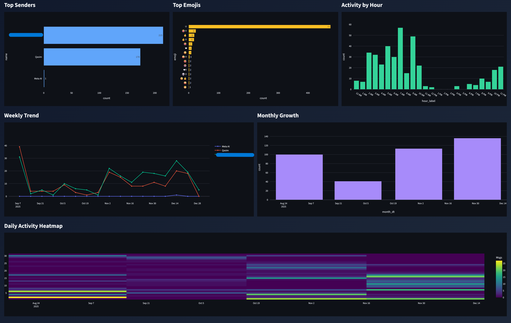

# 📊 Instagram Chat Analyzer

A privacy-friendly, mobile-first tool to analyze your Instagram chat history. Built with [Streamlit](https://streamlit.io/).



## 🚀 Features

- **Privacy First**: Analysis runs locally in your browser. No data is uploaded to any server.
- **Interactive Dashboards**: Visualize top senders, emoji usage, daily activity, and more.
- **Mobile Optimized**: Looks great on your phone and desktop.

## 🛠️ Setup & Run

1. **Clone the repo**

   ```bash
   git clone https://github.com/qasimmansoori/Insta-chat-analyzer.git
   cd Insta-chat-analyzer
   ```

2. **Install dependencies**

   ```bash
   pip install -r requirements.txt
   ```

3. **Run the app**
   ```bash
   streamlit run insta_analyser.py
   ```

## 📥 How to get your data

1. Instagram Settings → Your Information and Permissions → Download Your Information.
2. Select **Messages**, format **HTML**.
3. Download and extract the zip file.
4. Upload `message_1.html` files to the app.
